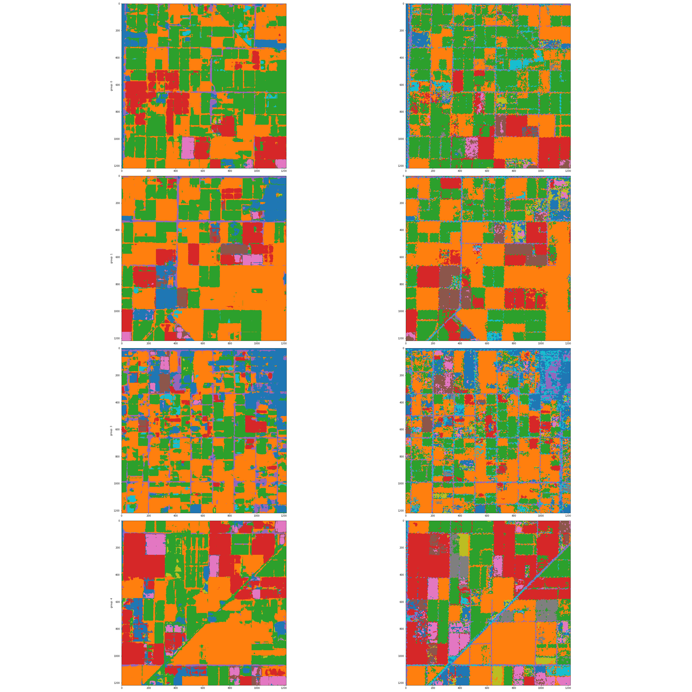

# cropland-ds-2020
## Introduction
A small data science demo project that shows supervised and unsupervised classification on a small dataset using publicly available satellite imagery that was found here: [Kaggle Dataset](https://www.kaggle.com/bhavesh907/crop-classificationcs2292017usgscroplanddata)

This dataset was used for a similar project located at: https://github.com/bhavesh907/Crop-Classification, which in turn was inspired by this [paper](http://cs229.stanford.edu/proj2017/final-reports/5243811.pdf) by Rustowicz, which uses multiple hyperspectral images acquired over a single growing season to make better crop predictions than possible using only a single image acquired during the growing season.  This intuitively makes sense, because different crops will grow at different rates over time, and have varying spectral characteristics as the season progresses, which should be easily recognizable in the temporal domain.  In general, it looks like the predictions from the multi-temporal approach are more consistent spatially than those found in the original USDA Cropland dataset. 

My main contributions are:
1. to explore dimensionality reduction techniques to see if all of the temporal slices and bands are needed,
2. to investigate the use of unsupervised classification,  
3. to test using higher dimensional (2D/3D) convolutional neural networks to try to produce more consistent and better labels.

In this case, a 2D-convolutional neural network treats each of the temporal images as an additional set of channels, and then runs the convolution over the spatial dimensions of the "hyper" image. This has an advantage over the 1D convolutional neural network used by Rustowicz and bhaevesh in that it should allow for more spatial continuity in the predicted labels, as the 1D convolution does not take into account the spatial autocorrelation between nearby samples.  

## Results

In the course of my analysis, I found that approximately 20 of the feature were meaningful, while the remaining 55 features appeared to be redundant or of minimal significance.  I was able to demonstrate that by showing that the subset of features was able to perform similarly well to the full feature set using a Random Forest classifier.  Using those features, I trained a 2D convolutional neural network on 64x64 tiles of the data and successfully made predictions for each of the 10 classes in the ground truth image.

Below is a figure that shows the predictions from the convolutional neural network.  In this figure, I am showing the result of my model compared to the ground truth classes on the right
 for multiple segments of the larger image that have been held out as an independent testing set (both on same colorbar). This allows us to evaluate the performance of the model on entirely unseen areas of the image, whereas a naive random sampling scheme would ensure that training data was used from almost the entire image thereby failing to take into account the significant amount of spatial autocorrelation in the data.
 
 Overall, the predictions are fairly consistent with the ground truth labels, but there are some notable discrepancies.  The real question here is who is right.  Ultimately, we would have to know more about this dataset, and how the ground truth labels are generated to be able to say definitively which one is correct.

## Code 
All of the analysis for this project was done in Python, using a combination of standalone utility scripts and Jupyter notebooks. This work was mostly done using an Amazon SageMaker m5.xlarge instance, and I used a p2.xlarge instance for the convolutional neural network part.  Additionally, you will need to setup an S3 bucket named: cropland-ds for the data to go to.  If you want to use a different bucket name you'll need to edit: common.py which contains path constants for the buckets and folder structure.

The notebooks can be run in this order to reproduce the results. Unless otherwise noted, these can run on a m5.xlarge node:
1. Install Required Dependences - CPU (installs all necessary python requirements inside a SageMaker python3 environment)
2. Download Data (downloads and extracts the data to S3; requires Kaggle API credentials)
3. Convert from GDAL to TIFF (converts the data from geotiff to a usable format)
4. EDA (Exploratory Data Analysis)
5. Feature Selection (try to determine if there are redundant features)
6. Unsupervised Classification (try to determine the natural number of classes in the data without using the labels)
7. Conv Nets (supervised classification using convolutional neural networks, compared to a few other methods)

The utilty scripts are: 
- common.py - utilities to read/write common data types to S3 buckets
- plot_util.py - utilities to plot multi-band images
- preprocess.py - utilities to normalize the data and perform any other pre-processing
- stats.py - utilties to compute summary statistics in a uniform way

### Note: for the sake of expediency I have borrowed code snippets from other authors to help with reading the data from geotiff files.  Where I have done so, I have clearly accredited the original author.
